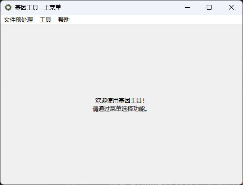
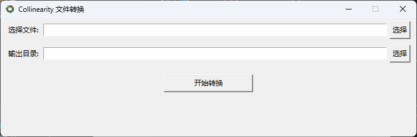
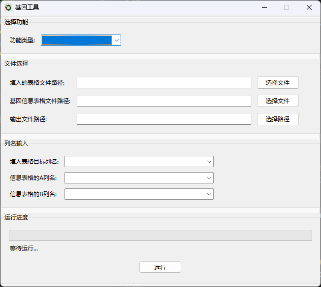
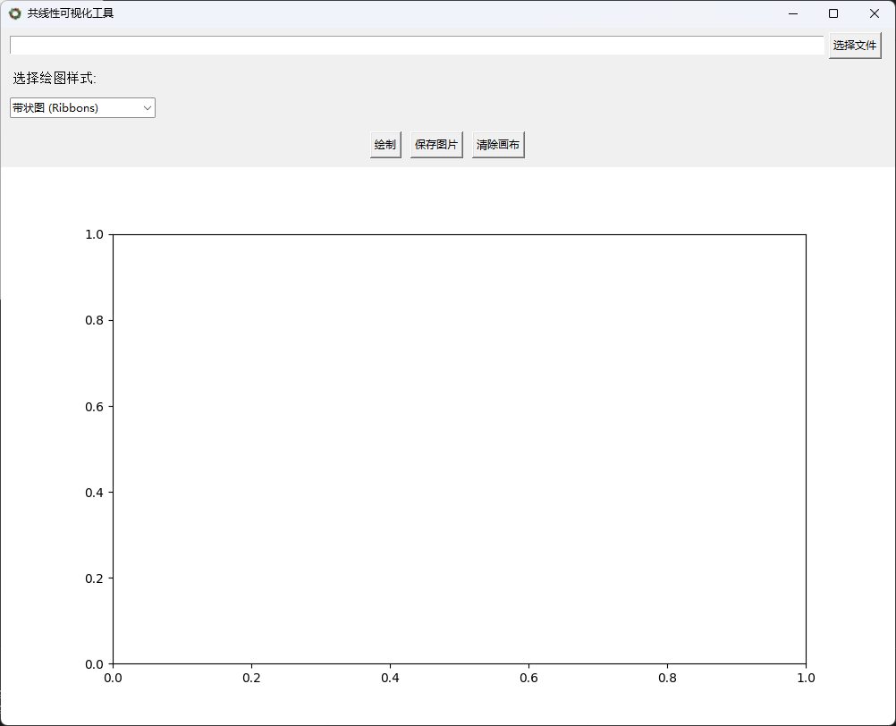

# 基因工具 使用说明书

## 版本说明

- 当前版本：v1.2
- 本版本在原有基因查询与匹配功能基础上，改为主菜单式启动，拆分为若干子模块，便于扩展与打包（兼容 PyInstaller）。

## 一、主要新增（v1.2）

- 主菜单界面：统一入口，包含“文件预处理”、“工具（基因匹配）”、“可视化”、“帮助”等菜单项。 
 
- 文件转换模块：独立的 “信息表格转换” 界面（package/File_conversion）。  

- 基因匹配模块：独立 GUI（package/gene_match_gui），保留横向/竖向、模糊/精确匹配逻辑。 
 
- 共线性可视化：独立界面（package/Collinearity_Visualization）。 
  
- 帮助/关于：集成使用说明与关于信息窗口。  
- 资源路径兼容：新增 resource_path 函数，支持 PyInstaller 打包后的资源查找。  
- 图标加载：支持从 package/icon.ico 加载主窗口与子窗口图标（不存在时安全降级）。

## 二、运行环境与依赖

- Python 3.8+（推荐 3.9+）  
- 依赖库（按需安装）：openpyxl、pandas（如部分模块使用）  
  安装示例：
  
  ```bash
  pip install openpyxl pandas
  ```

- tkinter：随 Python 自带（若缺失按系统方式安装）。

## 三、如何启动

- 直接运行主程序：
  
  ```bash
  python 1.2/main.py
  ```

- 根据'''.bat'''文件自行打包为exe运行程序
- 根据'''.iss'''文件自行打包为exe安装程序
- 或在联系开发人员发送exe安装包。

## 四、界面与菜单简要

- 文件预处理：包含“基因ID”“信息表格转换”等子项。  
- 工具：打开“基因匹配”子窗口进行匹配操作。  
- 可视化：包含“共线性可视化”等功能窗口。  
- 帮助：查看使用说明或关于信息。

## 五、打包与资源

- 程序包含 resource_path 函数以支持 PyInstaller 打包时访问打包资源。  
- 打包后请确认 icon 等资源被包含在打包数据中。

## 六、注意事项

- 保证输入为 .xlsx 格式且含表头。  
- 若找不到图标或资源，程序会跳过图标设置并继续运行。  
- 子模块文件位于 package 目录，调试或拓展建议优先查看对应模块源码。

## 七、反馈

如有建议或问题，请反馈：522723song@gmail.com

